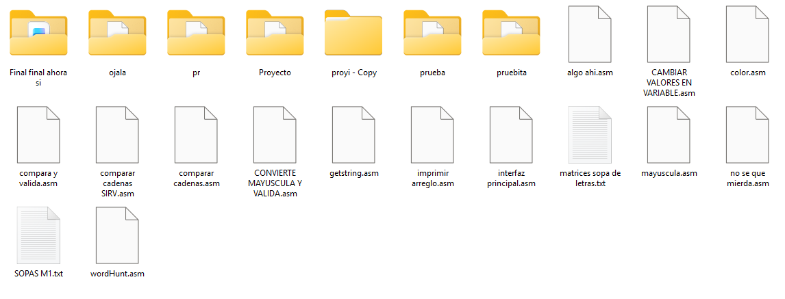

## Sopa de Letras en Ensamblador (emu8086)

Si te sirve para lo que te pide el/la profe, chévere.

No fue la manera más óptima de hacerlo, hay hardcodeo por todos lados. Pero nos salvó el semestre, pilas.

> xd
